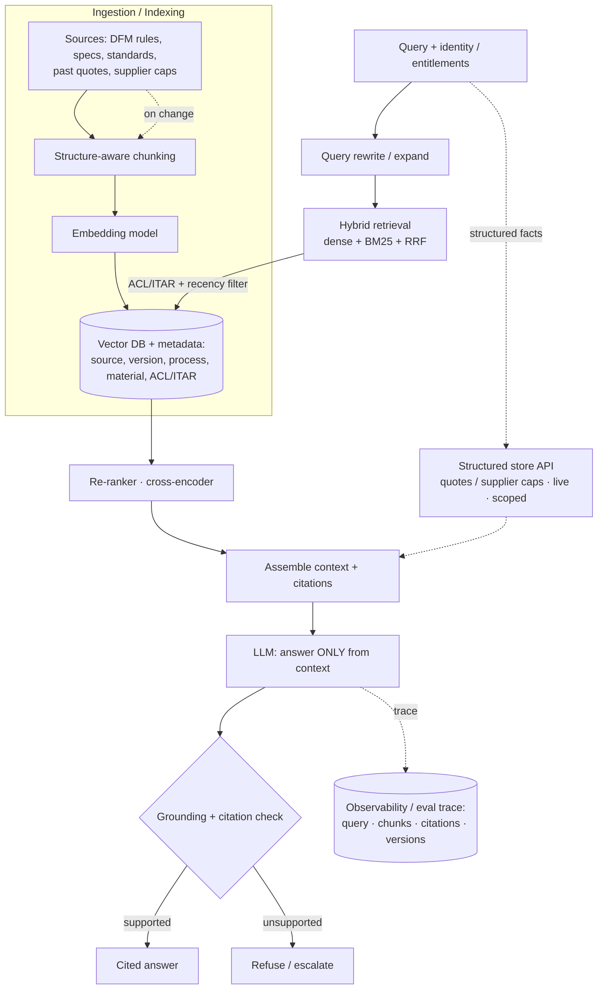

# System Design #1 — RAG over Manufacturing Knowledge ★

**Prompt:** *"Design a RAG system that lets engineers and the quoting tools get accurate, cited answers over Xometry's manufacturing knowledge — DFM guidelines, material/process specs, tolerancing standards, supplier capabilities, and historical quotes."*

> ★ Most likely prompt — you heard they test "building LLM RAG systems." Companion one-pager: `../Xometry_RAG_Cheatsheet.pdf`.
> **Panel:** Karim Abdelkader (Staff Cloud/MLOps — weight serving, AWS, lifecycle) · Henrique Oliveira Evangelista (SWE/ML — clean interfaces, data contracts).

---

## 🎯 What success looks like (business)
**Business metrics:** time-to-quote ↓ · quote / manufacturing error rate ↓ · engineer productivity ↑ · answer consistency ↑ · % questions self-served ↑.

The system is a win for Xometry if it:
- **Speeds up quoting & DFM feedback** — engineers and the quoting tools get instant, accurate, **cited** answers instead of hunting through specs/standards → faster time-to-quote.
- **Reduces costly errors** — fewer mis-quotes or manufacturing mistakes from a wrong/outdated DFM rule or spec (each one = scrap or lost margin).
- **Scales tribal knowledge** — captures expert manufacturing know-how so any engineer (and the marketplace) can use it, instead of relying on a few specialists.
- **Stays trustworthy & compliant** — every answer is grounded, cited, and auditable, and ITAR/entitled data never leaks.

---

## 1. Clarify & scope (say assumptions out loud)
- **Objective:** accurate, **cited**, up-to-date answers grounded in approved sources — no hallucinated specs (a wrong DFM rule mis-prices or mis-manufactures a part).
- **Consumers:** internal engineering copilot, the quoting / DFM-feedback system, supplier-ops.
- **Sources:** DFM rules, material datasheets, process capability docs, ASME Y14.5 / ISO standards, historical quotes/orders, supplier capability profiles. Some are **structured** (quotes, capabilities) → hybrid structured + vector.
- **Constraints:** **ITAR** (some data export-controlled → self-hosted, access-scoped), freshness (specs/suppliers change), auditability (which source backed which answer).
- **SLA:** retrieval adds < ~300 ms; end-to-end a few seconds interactive, relaxed for batch.
- **Out of scope:** giving engineering advice beyond source content.

**Frame:** two ML sub-problems + a guarantee — **retrieval = ranking**; **generation = grounded conditional generation with citations**; **guarantee = access/ITAR scoping enforced at retrieval *and* generation.**

## 2. Metrics
- **Retrieval:** recall@k, MRR/nDCG, context precision.
- **End-to-end:** **faithfulness/groundedness** (every claim cited?), answer relevance, **citation correctness**, refusal rate when context thin.
- **Safety:** zero cross-access leakage of ITAR/entitled data (adversarially tested).
- **Cost tie-in:** better retrieval → fewer/smaller chunks → fewer tokens → lower inference cost; re-ranking trades a little latency for big faithfulness gains.

## 3. Architecture (draw, grow in stages)

**Grow it in 5 stages while narrating:** (1) baseline top-k → (2) hybrid + re-ranker for "wrong doc" → (3) grounding/citation check for hallucination → (4) ACL/ITAR filter at retrieval + re-check before gen → (5) incremental re-index + versioning for freshness.

## 4. Data & indexing
- **Ingestion:** docs → **structure-aware chunking** (by heading/table, not blind fixed-size) → embedding → Vector DB with rich metadata (source, version, effective date, process, material, **ACL/ITAR tags**).
- **Structured sources** (quotes, supplier capabilities): keep in a structured store; fetch live and scoped — don't bury exact numbers in fuzzy vector search.
- **Freshness:** incremental/streaming re-index on change; version + effective-dating; staleness monitoring. Serve the spec version effective *now*.
- **Hybrid features:** dense embeddings + BM25 (catches exact part #s, ASME clause codes); metadata filters for entitlement + recency.

## 5. Modeling (baseline → complexity)
- **Baseline:** single embedding model + top-k dense + "answer only from context" prompt with citations.
- **Add only what moves faithfulness/recall:** hybrid (dense+BM25) → cross-encoder re-ranker → query rewrite/expansion → small-to-big chunk expansion → optional agentic multi-hop for "compare process A vs B across specs."
- **Defend RAG over fine-tuning:** specs/suppliers change constantly; RAG gives **citations + freshness + auditability**; fine-tune only for style/format, not facts.

## 6. The retrieval funnel — own this (diagnose with recall@k / faithfulness at each step)
- **Ingestion:** chunking strategy ★ · size+overlap ~10–20% · embedding model (swap = full re-embed = migration) · metadata enrichment · HNSW vs IVF-PQ (`ef_search`/`nprobe`) · parent→child.
- **Retrieval:** top-k · dense vs BM25 vs **hybrid** · RRF/weights · metadata+ACL filters · query rewrite / HyDE / multi-query.
- **Re-rank:** cross-encoder / ColBERT ★ · shortlist-in vs final-n (precision vs latency).
- **Generation:** # chunks · ordering (lost-in-middle) · "answer only from context" + cite + refuse · threshold · model+decoding.
> **Two highest-leverage levers first: chunking strategy + add a re-ranker.**

## 7. Serving & MLOps (Karim's lens)
- **AWS:** S3 (docs), OpenSearch / vector store, SQS + ECS/Lambda for the pipeline, the inference platform (see doc #4) for generation; Terraform IaC.
- **Caching:** embedding cache for repeat queries; **semantic answer cache scoped per entitlement**.
- **Lifecycle:** embedding-model upgrade = planned full re-embed (a migration); golden-set + thumbs-down feedback loop; CI gate on recall@k + faithfulness before any index/prompt change ships.
- **Observability:** trace query · retrieved chunks · citations · versions · latency · cost.

## 8. Scaling the RAG system
Scaling is four axes — **throughput, latency, cost, reliability** — and the trick is to separate the cheap stateless parts from the expensive ones (LLM generation + vector search). Walk it layer by layer:

- **Stateless, horizontal app/orchestration tier.** Gateway, query rewriter, and assembler are stateless behind a load balancer, autoscaled on QPS. Any conversational/session state lives in an external store (Redis/DynamoDB + TTL) — never in process — so any node serves any request.
- **Vector DB.** Scale with **sharding** (by tenant/domain) + **read replicas**; tune ANN params (`ef_search`/`nprobe`, HNSW vs IVF-PQ) for the recall-vs-latency-vs-memory point; quantize embeddings (PQ) to fit memory. Keep the **embedding cache** hot for repeated queries.
- **Re-ranker.** The cross-encoder is a latency/cost knob: cap the shortlist (e.g., re-rank top 50–100), batch on GPU, and skip re-ranking for high-confidence retrievals.
- **LLM generation tier (the dominant cost/latency).** Continuous batching + paged-attention KV cache (vLLM); **prefix-cache the shared system prompt**; **stream tokens** so first-token latency is fast even on long answers; **model tiering** — a small model for simple lookups, the large model only for hard synthesis; **semantic answer cache** (scoped per entitlement) for repeated DFM/spec questions. Autoscale GPU pools on queue depth + utilization.
- **Caching at every layer:** embedding cache → retrieval/result cache → semantic answer cache → prefix cache. In a manufacturing knowledge base many queries repeat (same DFM rules, same materials), so caching pays off hard.
- **Protect under load:** per-tenant rate limits/quotas, priority queue, load shedding/backpressure when GPUs saturate, circuit breakers, and **graceful degradation** (fall back to retrieval-only "here are the source passages" if generation is down).
- **Quantify (binding constraint is usually GPU memory or vector-search latency):** QPS, p95 end-to-end, tokens/sec/GPU, KV-cache memory/request, vector-search ms at corpus size N, $/query. Example latency budget for one query: auth ~10ms · query rewrite ~50ms · hybrid retrieval ~80ms · re-rank ~60ms · generation TTFT ~400ms (stream the rest) · grounding check in parallel. Retrieval should stay < ~300ms of the budget.

> One-liner: *"The retrieval and app tiers scale horizontally (shard/replicate the vector DB, stateless services, cache aggressively); the real cost is generation, so I lean on continuous batching, prefix/semantic caching, and model-tiered routing, stream tokens to hide latency, and degrade gracefully to retrieval-only — quantifying GPU memory and the sub-300ms retrieval budget as I go."*

## 9. Interviewer probes (model answers)
- *Wrong doc retrieved?* → walk the funnel: chunking/embedding first, then hybrid + re-ranker, then top-k/metadata; diagnose with recall@k on a golden set.
- *Specs change weekly?* → incremental/streaming index, versioning + effective dates, staleness monitors, serve current only; embedding swap = full re-embed.
- *ITAR / access isolation?* → ACL/ITAR tags per chunk; filter at retrieval **and** re-check before generation; export-controlled data self-hosted, never co-mingled; live structured-store fetch for entitled data instead of indexing it; adversarial tests.
- *Measure hallucination?* → groundedness (LLM-judge calibrated to human) + citation verification + refusal tracking.
- *When is RAG the wrong tool?* → reasoning over the whole corpus (pre-computed summaries/agents), latency budget too tight, or knowledge tiny+static (put in prompt).
- *LLM-judge unreliable?* → calibrate to human labels, use for relative ranking not absolute truth, audit periodically.

## 10. Xometry angles to weave in unprompted
ITAR → self-host + access-scope export-controlled data · hybrid (BM25) for exact part #s / ASME clause codes · name standards (ASME Y14.5 / ISO 1101) · frame mis-retrieval in $ (a wrong spec = a mis-quote or scrapped part) · structured store for quotes/capabilities, not vector search · RAG over fine-tune for citations+freshness+auditability.

## 11. Questions to ask
- What knowledge sources exist today, and how are specs/supplier data kept current?
- Vector store in place, or greenfield? OpenSearch / pgvector / dedicated?
- How is ITAR/data-isolation handled in the current stack?
- Who consumes the answers — engineers, the quoting engine, both?
