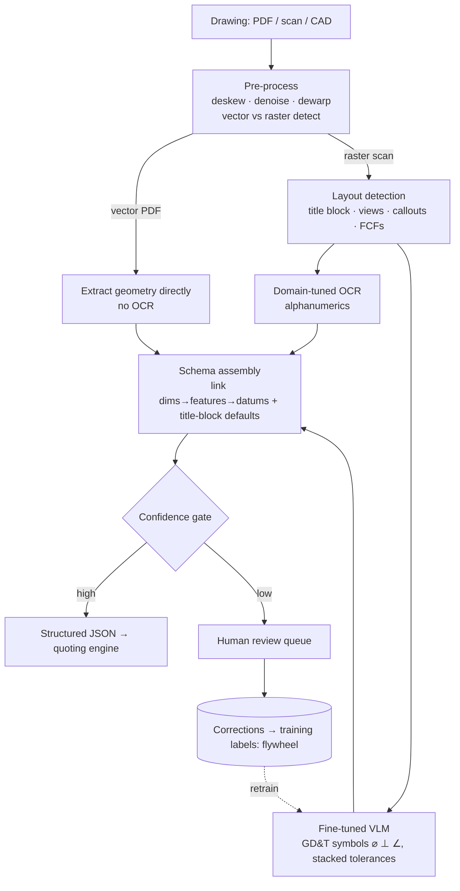

# System Design #2 — Structured Extraction from Engineering Drawings ★

**Prompt:** *"Design a system to extract dimensions, tolerances, and GD&T from engineering drawings / noisy PDFs into a structured schema, at scale (e.g., 100k docs/day), feeding the quoting engine."*

> ★ The literal core of the JD ("extracting structured data from technical drawings").
> **Panel:** Karim Abdelkader (Staff Cloud/MLOps — serving, scale, AWS) · Henrique Oliveira Evangelista (SWE/ML — data contracts, testing).

---

## 🎯 What success looks like (business)
**Business metrics:** quote turnaround time ↓ · % drawings auto-processed without review ↑ · cost per quote ↓ · scrap / mis-quote rate ↓ · RFQ throughput ↑ · reviewer hours saved.

The system is a win for Xometry if it:
- **Turns customer drawings into instant, accurate quotes** — automated extraction feeds the quoting engine so RFQs are priced in seconds, not hours/days of manual engineering review.
- **Scales volume without headcount** — handle far more incoming drawings at the same ops cost; reviewers only touch low-confidence cases.
- **Protects margin & avoids scrap** — accurate tolerances/GD&T mean correct pricing and correctly-made parts; a missed or mis-read callout = a mis-quote or a scrapped part.

---

## 1. Clarify & scope
- **Volume / latency:** batch backfill (100k/day) vs near-real-time for a live quote? Design for both — async batch + a low-latency path.
- **Inputs:** **vector PDF vs raster scan vs native CAD** — branches the pipeline (huge point: don't OCR geometry already in a vector file).
- **Accuracy bar + cost of errors:** a wrong tolerance = a scrapped part. Errors are expensive, so **recall of every callout** matters more than raw throughput.
- **Consumer:** the quoting/DFM engine (machine-readable) and a human review queue.
- **Standards:** ASME Y14.5 / ISO 1101 govern GD&T — name them.

## 2. Define the output contract first
A structured schema, not text:
```json
{ "part_id": "...", "units": "mm",
  "features": [ { "id": "hole_1", "type": "diameter", "nominal": 10.0,
      "tolerance": {"type": "limit", "upper": 10.05, "lower": 9.95},
      "gdt": [ {"symbol": "position", "zone": 0.1, "datums": ["A","B","C"]} ] } ],
  "title_block": {"material": "...", "general_tol": "...", "revision": "..."},
  "confidence": { "hole_1.nominal": 0.98, "...": 0.62 } }
```
Defining this disciplines the whole pipeline and the eval.

## 3. Approach — a pipeline, not one model

**Why not a single end-to-end VLM:** great for a demo, but on dense drawings it **silently drops or hallucinates callouts** — and a wrong tolerance scraps a part. Start VLM-heavy to get a baseline + labels fast, then move accuracy-critical pieces to **specialized, verifiable** components. Prefer deterministic geometry extraction wherever the PDF is vector.

## 4. Model choice & build-vs-buy
- **Prototype** on a closed VLM (Claude Opus / Gemini) to validate quality + generate labels fast.
- **Scale** on a fine-tuned open VLM (**Qwen-VL**) self-hosted for cost.
- **ITAR likely forces self-hosting** — drawings can be export-controlled. State this as an architectural constraint.

## 5. Data & training
- **Labeling:** gold set built with manufacturing/QA experts; stratify by drawing quality, standard (ASME vs ISO), and complexity.
- **Bootstrapping:** closed-VLM pre-labels → human correction → fine-tune the open VLM.
- **Synthetic data:** render CAD → drawings with known ground truth to augment rare GD&T symbols.

## 6. Serving & scale (Karim's lens)
- **Async batch:** S3 upload → SQS → preprocessing workers → **GPU inference service (autoscaled, dynamic batching)** → schema assembly → confidence gate. Scale on queue depth + GPU util.
- **Low-latency path** for live quotes: smaller model / cached results / partial extraction.
- **Infra:** model registry + versioning, shadow + canary deploy, Terraform IaC, cost dashboards ($/doc), retry/dead-letter queues for failures.

## 7. Eval
- **Field-level** precision/recall (not a blob score).
- **Tolerance exactness** — off-by-one is a hard fail.
- **GD&T frame correctness** including datum linkage.
- **★ Recall of missed callouts** — silent omissions are the dangerous failure mode; track it explicitly.
- **Calibrated confidence** per field → route low-confidence to human review.
- Stratify metrics by drawing quality / standard / complexity; monitor drift as new drawing styles/customers arrive.

## 8. Interviewer probes
- *Stop silently dropping a callout?* → layout detector ensures every region is accounted for; per-region confidence; reconciliation check (count callouts found vs expected); recall-of-missed-callouts metric gates releases.
- *Vector PDF vs raster — pipeline branch?* → detect at pre-process; vector → parse geometry directly (no OCR); raster → layout + OCR + VLM.
- *100k/day cost?* → batch + dynamic batching + autoscale + spot GPUs; route only hard regions to the big VLM.
- *Noisy scan?* → dewarp/denoise; if confidence low, escalate to human; never push a low-confidence tolerance into a quote.
- *How measure success in business terms?* → % drawings auto-processed without review, error rate weighted by scrap cost, reviewer time saved.

## 9. Xometry angles unprompted
Vector-PDF-vs-raster · ASME Y14.5 / ISO 1101 · ITAR self-hosting · errors-in-dollars (scrapped parts) · confidence-gated HITL with a label flywheel · build-VLM-baseline-then-specialize.

## 10. Questions to ask
- Today, how are drawings processed — manual, OCR, a model? What's the current error/review rate?
- Mix of vector PDFs vs scans vs native CAD?
- Latency target — is this batch enrichment or in the live quote path?
- How big is the human review team, and where does it sit in the loop?
