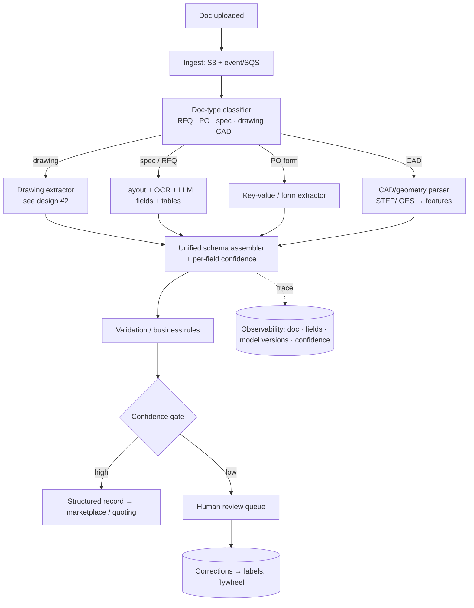

# System Design #3 — Multimodal Document Understanding Pipeline

**Prompt:** *"Design a system that ingests RFQs, POs, spec sheets, and engineering drawings (PDF, scan, CAD) and turns them into structured data the marketplace can act on."*

> Broader than doc #2 (drawings only): a platform that handles many document types and routes each to the right extractor.
> **Panel:** Karim Abdelkader (Staff Cloud/MLOps) · Henrique Oliveira Evangelista (SWE/ML).

---

## 1. Clarify & scope
- **Inputs:** mixed — RFQs (email/PDF), purchase orders (structured-ish forms), spec sheets (text+tables), engineering drawings (PDF/scan), native CAD (STEP/IGES).
- **Output:** a **unified structured schema** the quoting/marketplace systems consume, with per-field confidence.
- **Volume/latency:** event-driven on upload; batch for backfills; near-real-time for live quotes.
- **Constraints:** ITAR isolation, auditability, messy/low-quality inputs.

## 2. Architecture — classify, route, extract, assemble

## 3. Component decisions
- **Doc-type router:** a cheap classifier first (text + layout features, or a small VLM) — avoids running the heavy drawing/CAD path on a plain PO.
- **Extractors per type:**
  - *Drawings* → the pipeline in design #2 (vector-vs-raster, OCR + fine-tuned VLM, GD&T).
  - *Specs / RFQs* → layout detection → OCR → LLM for field + table extraction into schema.
  - *POs / forms* → key-value extraction (often template-based; cheapest).
  - *CAD* → deterministic geometry parser (STEP/IGES) — extract features directly; no model needed.
- **Unified schema + confidence:** every extractor emits the same contract so downstream is uniform; low-confidence fields route to review.
- **Validation:** business rules (units sane, tolerances within ranges, material recognized) catch obvious errors before they reach a quote.

## 4. Platform / reuse thinking (Karim + Henrique like this)
Build **one ingestion + extraction platform** many product teams build on: golden paths, self-serve onboarding of new doc types, a standardized output schema, and a shared review tool. Multi-tenant, versioned extractors, A/B per extractor.

## 5. Serving & MLOps
- Event-driven (S3 → Lambda/SQS → workers); GPU pool autoscaled for the model-heavy extractors; CPU for parsers/forms.
- Per-extractor model registry, shadow/canary, rollback on quality regression.
- Dead-letter queue + retries; idempotent processing; cost dashboards by doc type.
- Observability: trace doc → type → fields → model versions → confidence.

## 6. Eval
- Per-doc-type, per-field precision/recall; tolerance exactness for drawings; table-cell accuracy for specs.
- End-to-end: % docs auto-processed without review; downstream quote-error rate.
- Drift monitoring per doc type / customer; golden sets per type.

## 7. Interviewer probes
- *Unknown / new doc type?* → router low-confidence → human triage + collect examples → add an extractor or fine-tune the classifier.
- *One pipeline for very different docs?* → router + per-type extractors behind a unified schema; don't force one model to do everything.
- *Scale economics?* → cheapest path first (forms/CAD deterministic), reserve GPU VLM for drawings/hard specs.
- *Guarantee ITAR isolation?* → tag at ingest; route export-controlled docs to self-hosted extractors + scoped storage; never co-mingle.
- *Backfill 10M historical docs?* → batch queue, spot GPUs, throttle, checkpoint progress, prioritize by business value.

## 8. Xometry angles unprompted
Router-then-specialized-extractors (don't over-use the VLM) · CAD/forms are deterministic — no model needed · unified schema + confidence + HITL flywheel · platform/reuse · ITAR routing · validation rules as a cheap safety net.

## 9. Questions to ask
- What's the document mix and volume today? Which types are most painful?
- Is there an existing extraction/ingestion service, or greenfield?
- How standardized is the downstream schema the quoting engine expects?
- Where does human review happen now?
