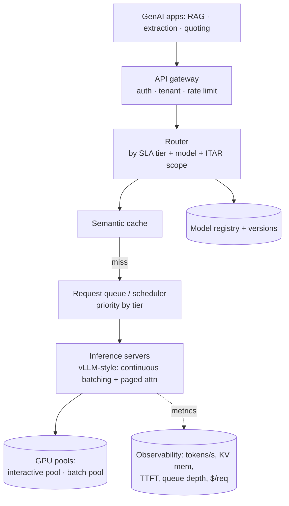

# System Design #4 — LLM Inference / Serving Platform

**Prompt:** *"Design the multi-tenant LLM inference platform that Xometry's GenAI apps (RAG copilot, extraction, quoting assist) run on. Optimize for latency, throughput, and cost."*

> ★ Karim Abdelkader's wheelhouse (Staff Cloud/MLOps). Even if another design is the main prompt, expect him to deep-dive serving — have this ready.
> **Panel:** Karim (cloud/MLOps/infra) · Henrique (SWE/ML).

---

## 🎯 What success looks like (business)
**Business metrics:** $/request (and total GenAI infra spend) ↓ · SLA/latency adherence ↑ · uptime ↑ · GPU utilization/efficiency ↑ · time-to-ship a new model ↓.

The platform is a win for Xometry if it:
- **Makes GenAI features economically viable** — keeps **cost per request** low enough that automated quoting/extraction/copilot actually save money versus the manual process they replace.
- **Keeps experiences fast & reliable** — meets latency SLAs so the copilot and quote flow feel instant, with high availability (no outages blocking quoting).
- **Lets the team ship safely & quickly** — better models roll out with canary + rollback, so improvements reach production fast without regressions or incidents.

---

## 1. Clarify & scope
- **Tenants/workloads:** interactive (RAG copilot — low latency) vs batch (drawing/doc extraction — throughput); mixed model sizes; self-hosted (ITAR) + maybe some API.
- **SLAs per tier:** e.g., interactive p95 first-token < 1s, full < 3s; batch optimizes $/token.
- **Constraints:** ITAR → self-hosted GPUs for export-controlled workloads; cost accountability per tenant; safe model rollouts.

## 2. Architecture

## 3. The levers you must name
- **Serving runtime:** **continuous / in-flight batching**, **paged attention / KV-cache management** (vLLM), tensor/pipeline parallelism for large models.
- **Throughput/latency:** quantization (INT8/FP8/AWQ/GPTQ), **speculative decoding**, **prefix/KV caching** for shared system prompts, disaggregated prefill vs decode, request scheduling + prioritization.
- **Scaling:** autoscale on GPU utilization + queue depth, scale-to-zero idle models, multi-model packing on a node, cold-start mitigation (snapshotting / fast weight loading), **spot GPUs for batch**.
- **Routing:** model registry + gateway routing by tenant SLA; A/B + canary + shadow traffic; **semantic caching** for repeated queries.
- **Hardware:** GPU memory is the binding constraint; batch size vs latency tradeoff.
- **Reliability:** load shedding, per-tenant quotas/rate limits, fallback to a smaller model under pressure, circuit breakers.

## 4. Quantify (they will ask)
- Tokens/sec per GPU; KV-cache memory per request; **max concurrency = f(GPU memory, context length)**.
- $/1k tokens; how batching + caching change it.
- **TTFT vs inter-token latency**, and which optimization affects which (speculative decoding → inter-token; prefix cache → TTFT).

## 5. Interviewer probes (model answers)
- *p99 latency spikes under load — diagnose.* → batching queue depth, KV-cache eviction, GPU saturation, head-of-line blocking; mitigate with priority queues + separate prefill/decode pools + load shedding.
- *Two tenants: one wants lowest latency, one lowest cost — same platform?* → tiered SLAs, separate pools or priority scheduling, per-tenant quotas.
- *Roll out a new model safely?* → shadow → canary → offline eval gate → automated rollback on quality/latency regression.
- *KV cache — what is it, why does it dominate GPU memory, how manage it?* → cached attention keys/values per token; grows with batch × context; paged attention + eviction + max-context limits.
- *How do speculative decoding & quantization affect latency/throughput/quality?* → spec decoding cuts inter-token latency (draft+verify) with no quality loss if verified; quantization cuts memory/cost, small quality risk — eval-gate it.
- *ITAR workloads?* → dedicated self-hosted GPU pool, network-isolated, scoped access; never routed to external APIs.

## 6. Xometry angles unprompted
ITAR → dedicated self-hosted, network-isolated GPU pools · interactive vs batch pools (don't let extraction starve the copilot) · spot GPUs for batch extraction · semantic cache for repeated DFM/quoting queries · cost accountability per tenant/app · eval-gated rollouts.

## 7. Questions to ask Karim
- Self-hosted, API, or hybrid today? What's the GPU footprint?
- Is there a shared inference platform, or does each app roll its own?
- Biggest current bottleneck — latency, cost, or reliability?
- How are model deploys gated and rolled back today?
