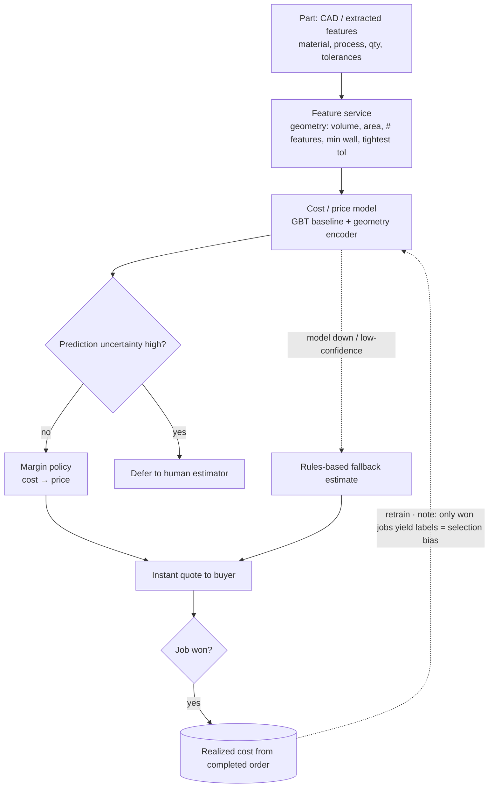
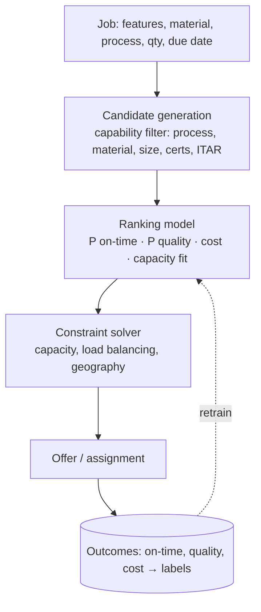

# System Design #5 — Marketplace ML: Instant Quoting + Supplier Matching

**Prompt (two related framings):**
- *"Design the system that produces an instant price quote for a custom part."*
- *"Design the system that matches a part/order to the right manufacturer in the supplier network."*

> The marketplace "business" framing — Xometry's core is predictive pricing + supply-demand matchmaking. Your Celect (retail predictive analytics) and Meta ranking background map directly here.
> **Panel:** Karim Abdelkader (Staff Cloud/MLOps) · Henrique Oliveira Evangelista (SWE/ML).

---

## 🎯 What success looks like (business)
**Business metrics:** quote win/conversion rate ↑ · realized margin accuracy ↑ · on-time delivery rate ↑ · defect/quality rate ↓ · capacity utilization ↑ · buyer + supplier retention ↑.

The system is a win for Xometry if it:
- **Wins more business at healthy margin** — instant, accurate quotes convert buyers while pricing protects margin (the win-rate ↔ margin balance).
- **Matches jobs to the right suppliers** — high on-time delivery and quality at good cost, with balanced capacity across the supplier network.
- **Keeps both sides of the marketplace healthy** — buyers get fast, reliable quotes and delivery; suppliers get well-matched, profitable work → retention on both sides.

---

## 📏 Scale & NFR estimate
**Expected load:** instant quoting in the buyer flow — assume ~50k–100k quote requests/day plus interactive buyers ≈ **~1–3 QPS avg, ~10–30 QPS peak** (sub-second SLA); matching runs per job (lower volume, can be async).
**Key NFRs:** quoting latency **sub-second p95** · price/cost calibration · matching on-time/quality accuracy · drift monitoring · $/quote.
**Binding constraint:** **low-latency feature serving + model accuracy/calibration**, not raw QPS. Precompute geometry features async; cache by part hash; rules-based fallback.

## 1. Clarify & scope
- **Quoting:** given a part (geometry/features from extraction or CAD, material, process, quantity, tolerances, lead time), predict a **price** (and cost + margin) instantly.
- **Matching:** given a job, rank suppliers by who can make it well, on time, at cost — a **ranking/retrieval** problem with capacity/constraints.
- **Latency:** instant (sub-second) for quoting in the buyer flow.
- **Objectives & tension:** win rate vs margin (quoting); quality + on-time + cost + capacity utilization (matching) — a two-sided marketplace, so balance buyer and supplier sides.

## 2. Part A — Instant Quoting (regression / cost model)
**Frame:** predict price (or cost, then apply margin policy) from part features.

- **Features:** geometry (volume, surface area, # features, complexity, min wall, tightest tolerance), material, process (CNC/3D-print/sheet), quantity (economies of scale), finish, lead time; market/demand signals; historical realized costs.
- **Inputs come from** the extraction pipeline (designs #2/#3) + CAD parser — note the dependency.
- **Model:** start with gradient-boosted trees (tabular, interpretable, strong baseline) → add a geometry encoder (GNN/3D CNN on the mesh) for complexity the hand features miss. Predict a **distribution / interval**, not just a point (uncertainty → risk pricing + when to defer to a human estimator).
- **Targets:** realized cost from completed orders (watch label delay + selection bias — you only see costs for won jobs).
- **Serving:** low-latency feature service + model; cache by part hash; fallback to a rules-based estimate if the model is uncertain or down.

## 3. Part B — Supplier Matching (ranking + constraints)
**Frame:** retrieve candidate suppliers, rank by expected quality/on-time/cost, subject to capacity & capability constraints.

- **Candidate generation:** hard filters (process, material, part size, certifications, **ITAR-eligible**, geography).
- **Ranking:** predict per supplier P(on-time), P(quality pass), expected cost, current load; combine into a score.
- **Constraints:** don't overload one shop; balance the network; respect deadlines → a scoring + assignment/optimization layer on top of the ML scores.
- **Cold start:** new suppliers have no history → use capability priors + exploration (bandit) to gather data.

## 4. Eval
- **Quoting:** price/cost MAE & calibration; **win rate vs margin** tradeoff curve; % auto-quoted without human; downstream realized-margin error.
- **Matching:** on-time rate, quality/defect rate, cost vs estimate, capacity utilization, supplier satisfaction (two-sided health).
- **Online:** A/B on business metrics (conversion, margin, on-time); guard against feedback loops (the model's choices shape future training data).

## 5. Serving & MLOps (Karim's lens)
- Real-time feature store (part features, supplier stats), low-latency model serving, caching.
- Model registry, shadow/canary, automated rollback on margin/win-rate regression.
- Monitor **drift** (new materials, cost inflation, supplier base changes) → retraining triggers.
- Observability: trace quote → features → model version → realized outcome.

## 6. Interviewer probes
- *Selection bias — you only see costs for won jobs?* → model the censoring; use lost-quote data; exploration; calibrate on realized costs.
- *Feedback loop — model's matches train the next model?* → exploration (bandits), logging propensities, off-policy correction, hold-out suppliers.
- *Cold-start a new supplier?* → capability priors + controlled exploration + faster feedback on early jobs.
- *Win rate vs margin?* → it's a business policy on top of a calibrated cost model; expose the tradeoff curve, let ops set the operating point.
- *Instant latency with a heavy geometry model?* → precompute geometry features at upload (async), cache by part hash, light model in the live path.
- *How does extraction quality affect quoting?* → garbage-in: a wrong tolerance mis-prices; propagate extraction confidence into quote uncertainty → defer to human when low.

## 7. Xometry angles unprompted
Two-sided marketplace health (balance buyer + supplier) · predict a distribution + uncertainty → human-in-the-loop for risky quotes · ITAR-eligibility as a hard matching filter · capacity/load-balancing as a constraint layer over ML scores · dependency on extraction quality (propagate confidence) · exploration to fight feedback loops.

## 8. Questions to ask
- Is quoting model-based today, rules-based, or hybrid? What's the auto-quote rate?
- How is matching done now — heuristics or ML?
- What's the biggest pain: margin accuracy, win rate, on-time, or capacity?
- How do realized costs/outcomes flow back as labels?

---

### Relationship to the other designs
Quoting/matching **consume** the structured output of designs #2/#3 (extraction) and may use #1 (RAG over supplier capabilities / DFM). Mentioning these dependencies shows systems-level thinking across the marketplace.
