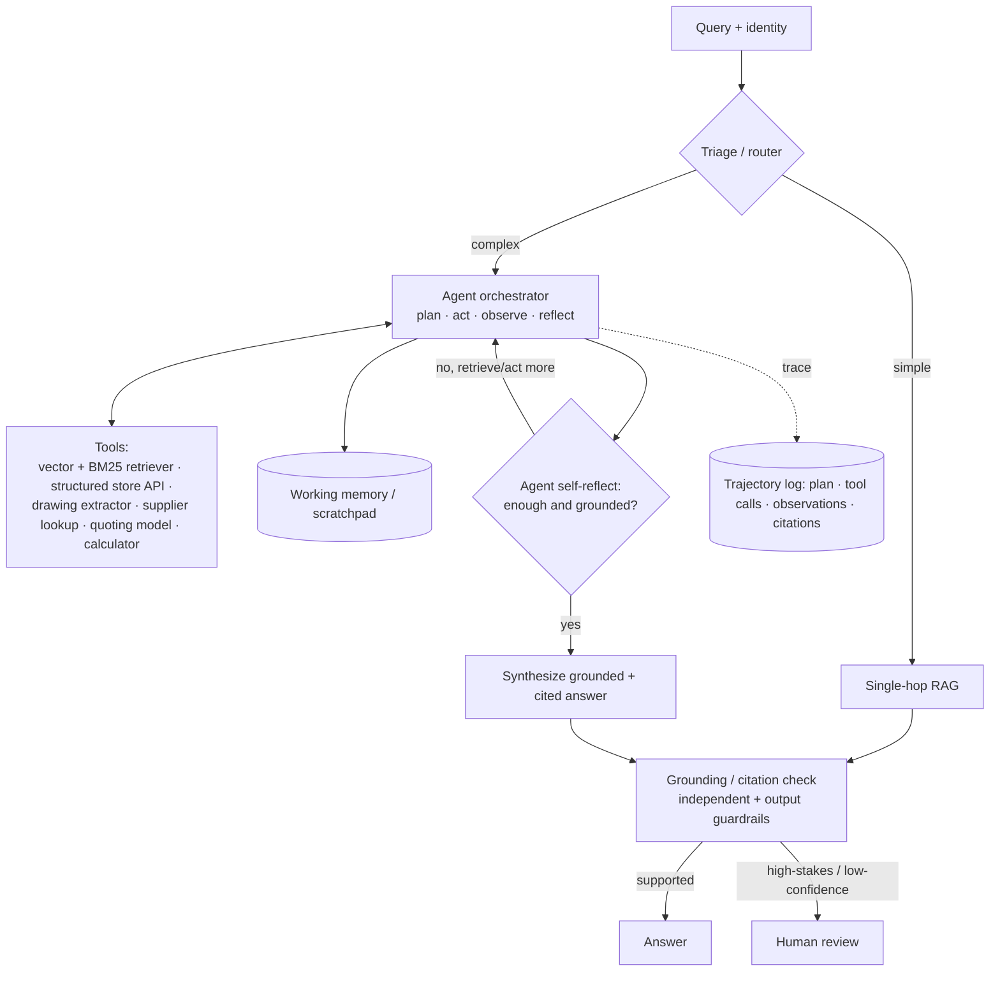

# System Design #6 — Agentic RAG

**Prompt:** *"Design an agentic RAG system: instead of a fixed retrieve→generate pipeline, an LLM agent dynamically plans and orchestrates retrieval and other tools to answer complex, multi-step manufacturing questions (e.g., 'Can we make this part, by when, at what price, and any DFM issues?')."*

> Builds on design #1 (RAG). The shift: retrieval becomes a **tool the agent calls** — possibly many times — and the LLM **plans, acts, observes, and reflects** in a loop rather than running one fixed pass.
> **#6 vs #7:** this is the **engine** (a technique — the reasoning loop; can be headless / single-query / batch). **#7 (concierge)** is a customer-facing **product** that *wraps* this engine with auth, session memory, actions+confirmation, and human handoff. Reach for #6 when the prompt says "agentic RAG"; for "design a chatbot/assistant," go to #7 and note its brain is #6.
> **Panel:** Karim Abdelkader (Staff Cloud/MLOps — serving, cost, reliability) · Henrique Oliveira Evangelista (SWE/ML — interfaces, tool contracts, testing).

---

## 🎯 What success looks like (business)
**Business metrics:** complex-question resolution rate ↑ · time-to-answer for multi-step asks ↓ · $/answered-query controlled · human escalations ↓ (without quality loss) · trajectory cost/latency within budget.

The system is a win for Xometry if it:
- **Answers end-to-end manufacturing questions** that span multiple systems ("can we make this, by when, for how much, any DFM issues?") in one assistant flow instead of an engineer stitching tools together by hand.
- **Automates the multi-step lookups** an expert would otherwise do manually (check capability → check supplier → estimate cost), freeing engineering time.
- **Stays economical & reliable** — only complex queries pay the agent's cost; simple ones stay on cheap RAG, and the agent never runs away on latency/$.
- **Stays trustworthy** — grounded, cited, auditable trajectories; ITAR/entitled data scoped; high-stakes outputs (an actual quote) go to human review.

---

## 1. Clarify & scope
- **Why agentic, not plain RAG?** The valuable questions are **multi-hop / multi-tool**: comparisons, multi-constraint lookups, or "find X then use it to find Y." A single retrieve→generate pass can't gather and reason across several sources.
- **Consumers:** internal engineering copilot, supplier-ops, possibly a buyer-facing assistant (with tighter guardrails).
- **Tools available:** vector + BM25 retrievers (DFM/specs/standards), **live structured store** (quotes, supplier capabilities), and **other subsystems as tools** — the drawing extractor (#2), supplier-capability lookup, the quoting model (#5), a calculator.
- **Constraints:** latency/cost budget per query, ITAR isolation, auditability, no autonomous money/commitments (a quote is reviewed, not auto-sent).

## 2. Frame the problem
- **Triage first.** Classify the query: **simple → single-hop RAG** (cheap, most traffic); **complex → agent loop**. Don't run the agent on everything.
- **The agent loop** is plan → act (call a tool) → observe → reflect → repeat until it has enough, then **synthesize a grounded, cited answer**. (ReAct-style, or plan-then-execute.)
- **Guarantee:** bounded, observable, and grounded — the agent can't loop forever, leak data, or answer ungrounded.

## 3. Architecture

## 4. Components (deep-dive)
- **Triage / router** — cheap classifier; routes simple→RAG, complex→agent. The single most important cost-control decision.
- **Orchestrator / planner** — the agent loop. ReAct (interleave reasoning + tool calls) for open-ended; plan-then-execute for known decompositions. Runs on a capable model; consider a **smaller planner model** for cost.
- **Tools** — each with a strict **contract** (typed inputs/outputs) so the agent can't misuse them. Wrap each in **timeouts + circuit breakers**. Prefer **deterministic tools** (structured queries, calculator) over fuzzy ones where possible.
- **Working memory** — scratchpad carrying evidence across hops; conversation memory if multi-turn.
- **Reflection / critique** — self-check groundedness, decide whether to retrieve more or stop; verify citations before answering.
- **Termination guardrails** — **max steps/hops**, latency/cost budget, loop detection, fallback to single-hop or human.
- **Output guardrails** — grounding/citation check, ITAR/PII leak check, refusal when unsupported.

## 5. When to use it — and when not to
- **Use:** comparisons ("process A vs B across specs"), multi-constraint ("suppliers with cert X *and* aluminum *and* this tolerance"), chained reasoning ("find the DFM rule, then check supplier X meets it"), and tasks needing computation or cross-subsystem calls.
- **Don't use (stay single-hop RAG):** simple factual lookups — most traffic. Agentic adds latency, cost, and failure modes for no gain there.

## 6. Tradeoffs (lead with these — the senior signal)
- **Latency & cost** — multiple LLM calls + retrievals per query. Control via step caps, **parallel fan-out** of independent sub-queries, caching, smaller planner model, and triage so only complex queries pay.
- **Reliability** — errors **compound across hops**; agents loop or hallucinate tool calls. Mitigate with bounded loops, deterministic tools, **tool-output validation**, and per-tool circuit breakers/timeouts.
- **Eval is harder** — you evaluate the **trajectory**, not just the final answer (see §7).
- **Auditability** — log the full trajectory (plan, tool calls, observations, citations); essential for debugging and ITAR/compliance trust.

## 7. Eval
- **Step/trajectory-level:** tool-selection accuracy (did it call the right tool?), per-hop retrieval recall, trajectory length + cost, loop/failure rate.
- **End-to-end:** task success rate, **faithfulness/groundedness**, citation correctness, refusal rate.
- **Method:** golden trajectories + LLM-as-judge calibrated to humans (for relative ranking, not absolute truth); offline regression suite gating prompt/tool changes.
- **Online:** sampled production trajectories scored; escalation/containment rate; cost-per-answer dashboards.

## 8. Serving & MLOps (Karim's lens)
- **Cost control:** triage routing; cap steps; cache tool results + sub-answers; smaller planner model; spot capacity for non-interactive agent runs.
- **Reliability:** per-tool circuit breakers + timeouts; bounded loops; graceful degradation to single-hop RAG; idempotent tool calls.
- **Observability:** trace every trajectory (plan → tool calls → observations → citations → latency → cost); alert on runaway loops, cost spikes, tool-error rates.
- **Rollout:** version prompts/tools/agent config as code; shadow + canary; automated rollback on task-success or cost regression.
- **ITAR:** tools + data self-hosted and identity-scoped; export-controlled tools never call external services.

## 9. Interviewer probes (model answers)
- *Agent loops forever / runs up cost?* → max-step cap + latency/cost budget + loop detection; fall back to single-hop or human; triage keeps most queries off the agent.
- *How do you keep it grounded?* → retrieval-as-tool returns cited evidence into working memory; reflection + final grounding/citation check; refuse when unsupported.
- *Eval an agent vs plain RAG?* → trajectory eval (tool-selection accuracy, per-hop recall, steps/cost) + end-to-end task success + faithfulness; golden trajectories.
- *When is agentic overkill?* → simple lookups — triage them to plain RAG; agentic only earns its cost on multi-hop/multi-tool questions.
- *Tool fails mid-trajectory?* → circuit breaker + timeout per tool; agent observes the failure and replans or degrades; validate tool outputs before trusting them.
- *ITAR / no autonomous commitments?* → scoped self-hosted tools; the agent proposes, humans approve high-stakes outputs (quotes).

## 10. Xometry angles to weave in unprompted
Triage simple→RAG, complex→agent (cost discipline) · subsystems-as-tools (extractor, supplier lookup, quoting model) for end-to-end answers · bounded loops + per-tool circuit breakers · trajectory logging for audit/ITAR · human-in-the-loop for actual quotes · deterministic tools (structured store, calculator) over fuzzy retrieval where exactness matters.

## 11. Questions to ask
- Are there end-to-end questions today that force engineers to stitch multiple tools by hand?
- What subsystems exist that an agent could call as tools (extraction, supplier DB, quoting)?
- What's the appetite for agent autonomy vs. human-approved outputs, given ITAR/quoting stakes?
- Is there existing agent/tooling infra, or greenfield?

---

### Relationship to the other designs
Agentic RAG **composes** the rest: it calls #2/#3 (extraction) and #5 (quoting/supplier lookup) as tools and uses #1 (RAG) for unstructured knowledge — all served on #4 (the inference platform). Mentioning this composition shows systems-level thinking across the whole marketplace.
