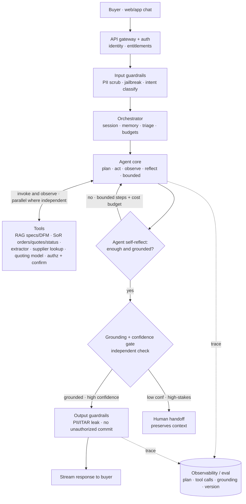

# System Design #7 — Conversational Concierge Chatbot

**Prompt:** *"Design a conversational concierge for Xometry — a chat front door where a buyer (or internal engineer) can ask questions, upload a drawing to get an instant quote, check order status, get DFM/manufacturability help, and reach a human when needed."*

> **Key distinction (say this up front):** a concierge is a **product / front-door**, not a technique. The concierge adds the **conversational layer**: intent routing, multi-turn memory, **action tools with confirmation**, human handoff, and graceful fallback.
> **Right-size it:** the default is a **single LLM agent doing grounded RAG + tool calls, with guardrails and confidence-gated human handoff** — not a multi-agent swarm. Reserve a multi-agent validation loop for the high-stakes **quote/commit** path only (a bank needs it everywhere; a manufacturing marketplace doesn't).
> **Panel:** Karim Abdelkader (Staff Cloud/MLOps — serving, latency, reliability) · Henrique Oliveira Evangelista (SWE/ML — interfaces, contracts).

---

## 🎯 What success looks like (business)
**Business metrics:** self-service containment rate ↑ · quote→order conversion ↑ · time-to-quote / time-to-answer ↓ · support cost per interaction ↓ · CSAT ↑ · **zero unauthorized commitments / data leaks**.

The concierge is a win for Xometry if it:
- **Deflects routine work** — answers DFM/material/status questions and produces quotes without a human, so engineers/sales focus on high-value cases.
- **Converts** — turns a buyer's "can you make this?" into an instant, accurate quote in one chat, lifting conversion.
- **Routes the hard stuff to the right human fast** — smooth handoff with full context, no repeating.
- **Stays safe & trustworthy** — grounded answers, no hallucinated prices/lead times, never commits an order/payment without explicit confirmation, ITAR/PII respected.

---

## 1. Clarify & scope
- **Who is it for?** Buyer-facing (get quotes, order status, manufacturability help) and/or an internal engineer copilot. Assume **buyer-facing primary**, internal mode reuses the engine.
- **Top intents:** get an instant quote (often via a drawing upload), check quote/order status, DFM/manufacturability + material/process questions, find capabilities, account/billing routing, talk to a human.
- **Latency:** interactive — stream responses; sub-second first token.
- **Hard constraints:** **never auto-commit an order or payment** without explicit confirmation; ground all facts (prices, lead times, status) in systems-of-record; **ITAR/PII** — a buyer must never see internal export-controlled data or another customer's data.

## 2. Frame: right-sized — a single grounded agent, escalate only when needed
- **Default design (this doc):** a **single LLM agent** that does RAG + tool calls with **strong grounding**, an independent **guardrails** layer, and **confidence-gated human handoff** — facts from systems-of-record, "answer only from retrieved context," escalate to a human when unsure or high-stakes.
- **Reused subsystems as tools:** #1 RAG (specs/DFM), #2 extraction (drawing→quote), #5 quoting/supplier, structured store for orders/quotes/status.
- **Escalate to multi-agent ONLY on the high-stakes path:** a planner→validator→executor→judge loop is justified for a *bank* (money movement, regulation); for a manufacturing marketplace it's overkill outside the **quote/commit** flow, where a wrong number costs real money. Default lean; add the validation loop surgically.
- **Guarantee:** grounded, safe, identity-scoped, and able to **gracefully degrade** to a human when confidence is low.

## 3. Architecture
The diagram to draw is the **agentic RAG concierge**: one agent in a bounded **plan → act → observe → reflect** loop over the tools, with a **grounding/confidence gate** and **human handoff**. (Right-size in words: triage simple lookups to plain single-shot RAG, and reserve a multi-agent validator for the quote/commit path — keep them out of the picture for clarity.)

**Narrate while drawing — grow it, verbalizing the simpler option you keep:**
1. **Naive:** User → Gateway → Orchestrator → single LLM → response. "Simplest thing that works."
2. **Tools / facts:** the agent calls **RAG (specs/DFM), SoR (orders/quotes/status), and tools (extractor, supplier lookup, quoting)** — facts from SoR, never the weights; independent calls in **parallel**.
3. **Bounded loop:** plan → act → observe → **reflect**; loop back if not done, capped by max steps + cost budget.
4. **Grounding + confidence gate** (centerpiece): grounded & confident → respond; low-confidence/high-stakes → **human handoff**.
5. **Guardrails** (separate layer — ITAR, no unauthorized commit) + **observability**. Action tools need **authz + confirmation** (a quote is proposed, never auto-placed).

**Right-size aloud:** *"I triage simple lookups to plain RAG so they don't pay the loop's cost, and I'd only add a multi-agent validator on the quote/commit path — a full multi-agent swarm is overkill for a marketplace."*

### If they say "agentic RAG" — flex up one rung
There's a ladder; pick the rung the prompt asks for:
1. **Single-shot grounded RAG** (the lean default above) — retrieve once, answer, grounding/confidence gate.
2. **Agentic RAG** ← *what "agentic RAG" means* — **one** agent in a **plan → act → observe → reflect loop**, deciding what to retrieve and which tools to call over multiple hops. (Retrieval is just one tool.)
3. **Multi-agent** — *separate* planner/validator/executor/judge agents. A further step; reserve for high-stakes/regulated.

**What changes #1 → #2:** single retrieve-then-answer becomes an **iterative loop**; add a planner, a **working-memory scratchpad**, a **reflection** step, and **termination guardrails** (max steps + cost budget). Keep a **triage router** so only complex/multi-hop questions enter the loop — simple lookups stay on plain RAG. The payoff: the agent can **chain subsystems** (extractor → supplier lookup → quoting model → DFM RAG) to answer "can we make this, by when, for how much, any DFM issues?" in one turn.

**Stays the same:** grounding from SoR, guardrails as a separate layer, confidence-gated human handoff, ITAR/auth scoping, no autonomous commit. **Eval adds** trajectory metrics (tool-selection accuracy, per-hop recall, steps/cost).

> **No separate diagram needed** — "agentic RAG" just means making the **complex / multi-hop branch** (the bounded `Agent loop`) in the §3 diagram the primary path instead of the exception.

**Soundbite:** *"If you want it agentic, I keep retrieval as one tool and put the agent in a bounded plan-act-observe-reflect loop for multi-hop reasoning and tool chaining — but I triage simple queries to plain RAG and cap steps + cost, because the agent earns its keep only on multi-step questions; everywhere else it's just latency and spend."*

## 4. Components (what the concierge adds on top of the brain)
- **Auth / identity / entitlements** — every turn is scoped to who's asking; gates what data/tools are allowed (ITAR, account isolation).
- **Session manager / memory** — short-term conversation state in a fast store (Redis) + relevant long-term context (account, past quotes), with TTLs and PII governance.
- **Intent router** — cheap classifier first: route to knowledge (brain), quote, status, account, or human. Keeps simple asks off the expensive agent.
- **Action tools with confirmation** — function-calling to real systems (create quote, check status) with **authz checks + an explicit confirm step** for anything that commits money or changes state. The model proposes; the user (or a human) confirms.
- **Human handoff** — escalate with full transcript/context for complex, high-value, or low-confidence cases; "talk to a person" always available.
- **Fallback flows** — deterministic scripted flows when the model is unsure or down; graceful degradation, never a dead end.
- **Persona / tone + multilingual** — consistent brand voice; refuse/clarify politely.

## 5. Grounding & safety (the high-stakes part)
- **Facts from systems-of-record, never the model's memory** — prices, lead times, order status come from live structured APIs; the LLM phrases, it doesn't invent. (Same "grounding > generation" principle as a bank assistant.)
- **No autonomous commitments** — never place an order or charge without explicit confirmation; tool-calls that change state require authz + a confirm step.
- **Isolation** — identity-scoped retrieval + a re-check before responding; a buyer never sees internal/ITAR data or another customer's records.
- **Input/output guardrails** — PII scrub, prompt-injection/abuse detection on input; grounding + leak checks on output, run **in parallel** to protect latency.

## 6. Serving & MLOps (Karim's lens)
- **Stream** responses (fast TTFT); **stateless** app tier behind a load balancer with session state externalized (Redis).
- **Model-tier:** small model for intent + simple FAQs, large model only when needed — the biggest cost lever.
- **Caching:** semantic cache for repeated questions; cache embeddings.
- **Reliability:** per-tool circuit breakers + timeouts (status API down → "I can't reach order status right now, want me to connect you to support?"); rate limits/quotas; load shedding; **always-available human fallback**.
- **Observability:** trace intent → tools → latency → cost → outcome; dashboards for containment, conversion, handoff, CSAT.
- **Rollout:** versioned prompts/flows as code; shadow + canary; rollback on containment/CSAT regression.

## 7. Eval
- **Intent accuracy** (routing).
- **Task success / containment rate** (resolved without a human).
- **Groundedness / hallucination** (esp. prices, lead times, status), **citation correctness**.
- **Safety:** zero unauthorized commitments, zero cross-customer/ITAR leaks (adversarially tested).
- **Handoff quality** (right cases escalated, context carried).
- **Business A/B:** conversion (quote→order), CSAT, support-cost deflection.

## 8. Interviewer probes (model answers)
- *Stop it quoting a wrong price / lead time?* → ground in the quoting subsystem + structured store; never from model memory; output grounding check; refuse/clarify or hand off when unsure.
- *User says "place the order"?* → never autonomous: authz + an explicit confirmation step (and often a human for high-value); the model proposes the action, the user/agent commits.
- *Status API is down?* → circuit breaker + graceful message + offer human handoff; don't fabricate a status.
- *Buyer asks something internal/ITAR?* → identity-scoped retrieval + output check; refuse and explain, never expose.
- *When does it escalate to a human?* → low confidence, high-value/complex, explicit request, or repeated failure — with full context so the user doesn't repeat themselves.
- *Concierge vs. just agentic RAG?* → the brain is agentic RAG; the concierge adds routing, session memory, action+confirmation, handoff, fallback, and a UX/safety layer.

## 9. Xometry angles to weave in unprompted
Grounding > generation for prices/status (systems-of-record) · never auto-commit an order/payment · identity-scoped + ITAR isolation for a buyer-facing surface · drawing-upload-to-quote as the killer flow (chains #2 extraction → #5 quoting) · always-available human handoff with context · containment + conversion as the business KPIs.

## 10. Questions to ask
- Is the concierge buyer-facing, an internal copilot, or both? Different safety bars.
- What actions should it be allowed to take vs. always route to a human (quotes, orders, refunds)?
- What systems-of-record exist for live status/pricing it must ground on?
- What's the current support deflection / conversion baseline to beat?

---

### Relationship to the other designs
This is the **product/front-door** layer. Its default brain is a **single grounded agent** (RAG over #1, calling #2 drawing→quote and #5 quoting/supplier as tools, served on #4 the inference platform); it escalates to **#6 agentic / multi-agent** only on the high-stakes quote/commit path. The concierge's own contribution is the conversational/routing/action/handoff/safety layer — that's the distinction to articulate (technique vs. product), along with the **right-sizing judgment** (don't over-engineer with multi-agent everywhere).
