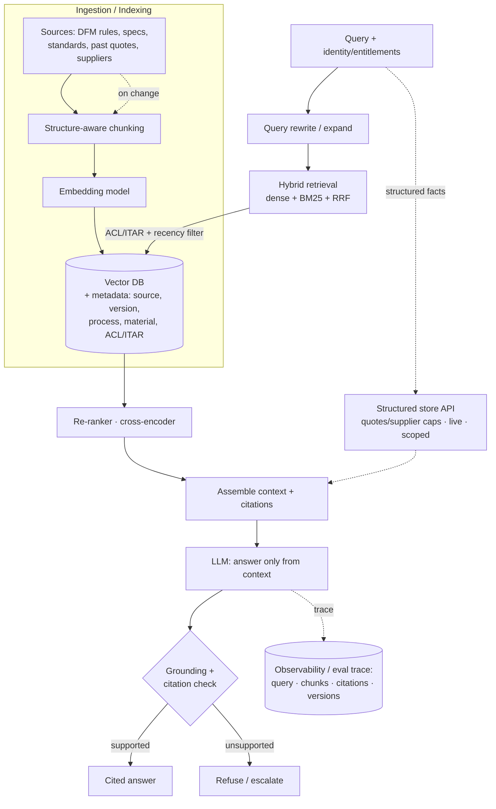

# Xometry — ML System Design Prep

**Role:** Staff MLE, Generative AI ([JD](https://job-boards.greenhouse.io/xometry/jobs/4871650007)) · **Round:** System Design, 60 min · **When:** Jun 26, 2026, 10–11a ET.
**Interviewers:** **Karim Abdelkader** (Staff Cloud Engineer — MLOps / cloud infra; ex-Under Armour) · **Henrique Oliveira Evangelista** (also ran your coding round — SWE/ML).

> Adapted from your Capital One system-design + RAG prep, re-skinned onto Xometry's problems. **Heads-up you got: they test "building LLM RAG systems" — so RAG is the centerpiece (§3).** Karim's lens means **infra / serving / MLOps / AWS** count as much as the modeling — design systems that *run in production*, not just models.

---

## 0. Read the panel
- **Karim = cloud/MLOps/infra.** Weight serving, scaling, AWS, CI/CD, monitoring, cost. Even a "modeling" prompt should pivot to "how do you deploy, scale, and operate this."
- **Henrique = SWE/ML.** Clean interfaces, data contracts, testing, pragmatic engineering.
- Both ex/at a pragmatic mid-cap marketplace → reward **pragmatism and impact**, not research flash.

---

## 1. The likely prompts (prepare these cold)
1. **RAG over manufacturing knowledge** — DFM rules, material specs, past quotes, supplier capabilities, standards docs. ★ *Most likely given your tip.*
2. **Structured extraction from engineering drawings** — dimensions, tolerances, GD&T → JSON schema, at scale. (JD core.)
3. **Multimodal document understanding** — ingest RFQs/POs/spec sheets/drawings (PDF, scan, CAD) → structured data feeding the quoting engine.
4. **LLM inference / serving platform** — multi-tenant, low-latency, cost-optimized on AWS (Karim's wheelhouse).
5. **Marketplace ML** — instant quoting/pricing, or part→supplier matching (could appear as the "business" framing).

Agentic tool-use, an embedding/feature store, and eval/observability are common sub-themes inside any of these.

---

## 2. The framework to drive (say the structure out loud)
1. **Clarify & scope** — users, use cases, volume (docs/day), latency (batch vs real-time quote), accuracy bar + **cost of errors** (wrong tolerance = scrapped part), inputs (vector PDF vs raster scan vs CAD), who consumes the output. State assumptions.
2. **Requirements** — functional vs non-functional; name SLAs as numbers (p95, QPS, freshness, availability).
3. **Define the output contract** — the structured schema (JSON: feature → dimension → tolerance → datum). Disciplines everything downstream.
4. **High-level architecture** — draw the boxes: ingest → preprocess → retrieve/model → assemble → guardrail/confidence → consumer. Data plane vs control plane.
5. **Deep-dive the hard parts** — they'll push on 1–2. Have depth on retrieval, extraction, and serving.
6. **Scale, cost, latency** — quantify. Think in tokens, GPU-hours, $/doc, ms.
7. **Eval, monitoring, lifecycle** — how you know it works, catch regressions, retrain.
8. **Failure modes & tradeoffs** — degradation, fallbacks, what you'd cut under time pressure.

> Staff-level = judgment, tradeoffs, influence over the "right" answer. Baseline first, then optimize. Lead every component with its tradeoff (latency vs cost vs quality vs risk).

---

## 3. ★ CENTERPIECE — RAG over Manufacturing Knowledge

**Prompt:** *"Design a RAG system that lets engineers/quoting tools get accurate, cited answers over Xometry's manufacturing knowledge — DFM guidelines, material/process specs, tolerancing standards, supplier capabilities, and historical quotes."*

### 3.1 Clarify & frame
- **Objective:** accurate, **cited**, up-to-date answers grounded in approved sources — no hallucinated specs (a wrong DFM rule mis-prices or mis-manufactures a part).
- **Consumers:** internal engineering copilot, the quoting/DFM-feedback system, supplier-ops.
- **Sources:** DFM rules, material datasheets, process capability docs, ASME Y14.5/ISO standards, historical quotes/orders, supplier capability profiles. Some are **structured** (quotes, capabilities) → consider hybrid structured + vector.
- **Constraints:** **ITAR** (some data export-controlled → self-hosted, access-scoped), freshness (specs/suppliers change), auditability (which source backed which answer).
- **SLA:** retrieval adds < ~300 ms; end-to-end within budget (a few seconds interactive; relaxed for batch).

Two ML sub-problems + a guarantee: **retrieval = ranking**; **generation = grounded conditional generation with citations**; **guarantee = access/ITAR scoping enforced at retrieval *and* generation.**

### 3.2 Pipeline (draw this, grow in stages)

### 3.3 The retrieval funnel — own this (your niche)
When asked "retrieval returned the wrong doc, fix it" or "improve quality," **walk the funnel stage by stage**, framing every knob as a tradeoff (recall vs latency vs cost vs faithfulness). Diagnose with **recall@k / faithfulness on a golden set** at each step.

- **Ingestion/indexing:** *chunking strategy* (semantic/structure-aware by heading/table — highest-leverage knob), chunk size & overlap (~10–20%), **embedding model** (domain fit; swapping = full re-embed = a migration), metadata enrichment (process, material, version, ACL/ITAR), index/ANN params (HNSW vs IVF-PQ; `ef_search`/`nprobe`), parent/child "small-to-big."
- **Retrieval:** top-k, dense vs lexical vs **hybrid** (BM25 catches exact part numbers/standard codes), fusion (RRF/weights), metadata + ACL filters, query transforms (rewrite, HyDE, multi-query).
- **Re-ranking:** whether to (cross-encoder / ColBERT), shortlist-in vs final-n (latency vs precision).
- **Generation:** # chunks injected (grounding vs token cost / "lost in the middle"), context ordering, "answer only from context" + citation + refusal prompt, grounding/refusal threshold, model tier + decoding.
- **Cross-cutting:** re-index cadence, caching (embedding cache + semantic answer cache scoped per entitlement), eval thresholds that gate changes.

> **Two highest-leverage levers to reach for first: chunking strategy and adding a re-ranker.**

### 3.4 Why RAG (defend it)
RAG over fine-tuning because specs/suppliers **change constantly** and RAG gives **citations + freshness + auditability**; fine-tune only for style/format, not facts. Hybrid for exact codes (part #s, ASME clauses) + paraphrase.

### 3.5 Eval & lifecycle
- **Retrieval:** recall@k, MRR/nDCG, context precision.
- **End-to-end:** **faithfulness/groundedness** (every claim cited?), answer relevance, **citation correctness**, refusal rate when context thin.
- **Lifecycle:** incremental re-index on doc change; versioning + effective dates (serve the *current* spec); embedding-model upgrade = planned full re-embed; golden-set + thumbs-down feedback loop.

### 3.6 Probes (model answers)
- *Wrong doc retrieved?* → walk the funnel: chunking/embedding first, then hybrid + re-ranker, then top-k/metadata; diagnose with recall@k.
- *Specs change weekly?* → incremental/streaming index, versioning + effective dates, staleness monitors, serve current only.
- *ITAR/access isolation?* → ACL/ITAR tags per chunk; filter at retrieval **and** re-check before generation; export-controlled data self-hosted, never co-mingled; adversarial tests.
- *Measure hallucination?* → groundedness (LLM-judge calibrated to human) + citation verification + refusal tracking.
- *When is RAG wrong?* → reasoning over the whole corpus (use pre-computed summaries/agents), latency budget too tight, or knowledge is tiny+static (put in prompt).

---

## 4. Worked design — Structured Extraction from Engineering Drawings (JD core)

**Prompt:** *"Extract dimensions, tolerances, GD&T from engineering drawings / noisy PDFs into a structured schema, at scale (e.g., 100k docs/day), feeding the quoting engine."*

- **Frame as structured, standards-governed** (ASME Y14.5 / ISO 1101). Output = JSON schema (feature → dimension → tolerance → datum), not text.
- **Pipeline, not one model:**
  1. **Pre-process:** deskew/denoise/dewarp; **detect vector PDF vs raster scan** — if vector, extract geometry directly (don't OCR).
  2. **Layout detection:** title block, views, callouts, feature control frames as regions.
  3. **Recognition:** domain-tuned OCR for alphanumerics; fine-tuned **VLM** for GD&T symbols (⌀ ⊥ ∠) + stacked tolerances where position carries meaning.
  4. **Assembly:** link dimensions→features→datums; apply title-block default tolerances.
- **Tradeoff to surface:** single end-to-end VLM demos well but **silently drops/hallucinates callouts** — and a wrong tolerance scraps a part. Start VLM-heavy for a baseline + labels, then move accuracy-critical pieces to verifiable components.
- **Model choice:** prototype on closed VLM (Claude Opus / Gemini); fine-tune **Qwen-VL self-hosted** for cost; **ITAR likely forces self-hosting**.
- **Architecture (Karim's lens):** ingest queue (SQS) → preprocessing workers → GPU inference service (autoscaled, batch) → schema assembly → **confidence-gated routing** → human-in-the-loop review → corrections feed back as labels (**flywheel**). S3 for docs, model registry, shadow/canary deploys, Terraform IaC.
- **Eval:** field-level precision/recall, **tolerance exactness** (off-by-one = hard fail), GD&T frame + datum correctness, and especially **recall of missed callouts** (the dangerous silent failure). Calibrated confidence routes low-confidence fields to review.

---

## 5. Worked design — Multimodal Document Understanding Pipeline

**Prompt:** *"Ingest RFQs, POs, spec sheets, and drawings (PDF, scan, CAD) and turn them into structured data the marketplace can act on."*

- **Classifier-first router:** detect doc type → route to the right extractor (drawing → §4 pipeline; text spec → layout+OCR+LLM; CAD → geometry parser).
- **Unified output schema** + confidence per field; **HITL** for low confidence.
- **Serving:** event-driven (S3 upload → Lambda/SQS → workers); batch for backfills, near-real-time for live quotes.
- **Reuse angle (platform thinking):** one ingestion+extraction platform many product teams build on — golden paths, self-serve, standardized schema. (Karim/Henrique like reuse.)

---

## 6. Worked design — LLM Inference / Serving Platform (Karim's wheelhouse)

Have these levers ready even if it's only a deep-dive:
- **Runtime:** continuous/in-flight batching, **paged attention / KV-cache mgmt** (vLLM-style), tensor/pipeline parallelism for big models.
- **Throughput/latency:** quantization (INT8/FP8/AWQ/GPTQ), **speculative decoding**, **prefix/KV caching** for shared system prompts, disaggregated prefill vs decode, request scheduling.
- **Scaling:** autoscale on GPU util + queue depth, scale-to-zero idle models, multi-model packing, cold-start mitigation.
- **Routing:** model registry + gateway by SLA, A/B + canary + shadow, **semantic caching**.
- **Quantify:** tokens/sec/GPU, KV-cache memory/request, max concurrency = f(GPU mem, context len), $/1k tokens, TTFT vs inter-token latency.
- **Reliability:** load shedding, per-tenant quotas, fallback to smaller model, circuit breakers.

---

## 7. Xometry-specific angles to weave in unprompted (separates senior from generic)
- **ITAR / self-hosting** as a real architectural constraint — most candidates miss it. Drives model choice + data isolation.
- **Vector-PDF vs raster scan** — don't OCR geometry already in the file.
- **Name the standards** — ASME Y14.5 / ISO 1101 — signals domain understanding.
- **Cost framing** — errors = scrapped parts / mis-priced quotes; frame eval and reliability in dollars (resonates with the marketplace + Karim).
- **Confidence-gated human-in-the-loop with a feedback flywheel** — corrections become training labels.
- **Build vs buy** — closed VLM to validate quality fast, self-hosted fine-tune for cost/ITAR at scale.
- **Platform/reuse** — you're building foundations other teams use; multi-tenancy, golden paths, standardization.

---

## 8. MLOps / serving checklist (say these for Karim)
CI/CD for models, model registry + versioning, shadow + canary + automated rollback on quality/latency regression, data + model lineage, drift detection (input + output quality), retraining triggers, infra-as-code (Terraform), autoscaling + cost dashboards, observability traces (inputs, retrieved context, model version, tokens, latency, confidence), reproducible training pipelines.

---

## 9. Rapid-fire to rehearse out loud
- Walk the latency budget of one RAG query, component by component.
- Retrieval returned the wrong spec — walk the funnel to fix it.
- Specs change weekly — keep the index fresh? (versioning, incremental re-index, embedding swap = migration.)
- How do you stop the extractor from silently dropping a tolerance callout?
- When fine-tune vs RAG vs prompt? Defend for the manufacturing-knowledge case.
- How does ITAR change your architecture?
- Design the rollback trigger for a bad model deploy — what signals, what thresholds?
- Where's the next dollar best spent: better retriever, more GPUs, or more human reviewers? Justify.
- Vector PDF vs raster scan — how does the pipeline branch?
- How do you measure success of the whole extraction system in business terms?

---

## 10. Questions to ask Karim / Henrique
- What does the current ML/GenAI stack look like, and where are the biggest infra gaps?
- How mature is the MLOps tooling (registry, CI/CD, monitoring) today?
- Real-time quoting vs batch extraction — what are the actual latency/volume targets?
- How is ITAR/data-isolation handled in the current architecture?
- Build-vs-buy posture on foundation models — self-host vs API today?
- Where does human-in-the-loop sit in the pipeline now, and how big is the review team?

---

## 11. Delivery reminders
- **Drive the structure**; state assumptions + SLAs as numbers up front.
- **Baseline first, then optimize.** Grow the diagram into each new requirement (esp. RAG: naive top-k → hybrid+re-ranker → grounding → ACL/ITAR → freshness).
- Lead every component with its **tradeoff**; quantify ≥1 number per component.
- **Pivot to serving/MLOps/cost** for Karim; keep interfaces/data-contracts clean for Henrique.
- Close with **failure modes, what you'd cut under time pressure, and how you measure success in dollars.**
