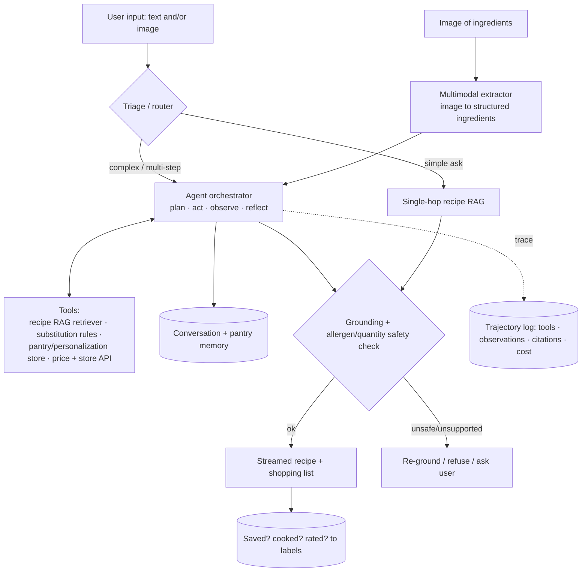

# Karim's "Sous Chef AI" — Rapport + Full Worked Design

**Why this doc:** Karim Abdelkader (your System Design interviewer, Staff Cloud/MLOps) built **Sous Chef AI** — an LLM + Agentic AI + GenAI cooking assistant. It's essentially an **agentic, multimodal RAG app**, which is the exact architecture he'll probe at Xometry. Use it two ways: (1) a genuine **rapport question** that shows you looked him up and speak his language, and (2) a **full design walkthrough** you can give if he frames a prompt in this flavor — it maps 1:1 to the Xometry designs.

> Sous Chef AI features (from his post): create custom recipes from **text or images** · **chat** for meal ideas + substitutions · **smart shopping lists with local price compare** · personalized video instructions · save/share/discover in a community cookbook. Built with **LLMs, Agentic AI, GenAI, MLOps**.

---

## 0. Rapport question to ask Karim
> *"I saw Sous Chef AI — really cool that you combined agentic AI with the MLOps side. What was the hardest part to get production-ready: keeping the agent's tool-calls reliable, grounding the recipes, or the cost/latency of the multimodal + agent loop? I ask because that's exactly the kind of tradeoff I'd expect productionizing GenAI here."*

It signals genuine interest, name-drops the real engineering tensions (tool reliability, grounding, agent cost/latency), and pivots straight back to the role. Listen for what he emphasizes — it tells you what he values in a Staff hire.

---

## The prompt (the kind he might give, mirroring his own project)
*"Design an AI cooking assistant: a user gives text or a photo of ingredients, it generates a custom recipe, lets them chat for substitutions, and builds a shopping list with local store price comparison. Walk me through the architecture."*

---

## 🎯 What success looks like (business)
**Business metrics:** session→cooked conversion ↑ · recipe groundedness / low hallucination ↑ · **zero allergen/safety misses** · cost per session controlled · retention + saved-recipe rate ↑.

The product is a win if it:
- **Turns messy input (a photo, a vague craving) into something the user actually cooks** — fast, grounded, personalized.
- **Saves real effort** — substitutions, shopping list, and price-compare done for the user, not by them.
- **Stays trustworthy & cheap** — no hallucinated quantities or missed allergens; only complex asks pay the agent's cost.

---

## 1. Clarify & scope
- **Inputs:** multimodal — free text ("something with chicken and what's in my fridge") + an **image** of ingredients/a dish.
- **Outputs:** a grounded recipe (streamed), a substitution chat, and a **price-compared shopping list**.
- **Latency:** interactive — stream the recipe for fast first-token.
- **Hard constraints:** **no hallucinated quantities or allergens** (the high-stakes failure), sane cost per session, graceful behavior when the price API is down.
- **Scale assumptions:** state them — e.g., thousands of concurrent users, image uploads, repeat queries.

## 2. Frame: it's agentic multimodal RAG
Two ML sub-problems + an orchestration layer + a guarantee:
- **Multimodal extraction** = image → structured ingredient list.
- **Grounded generation** = recipe/substitutions grounded in a retrieved corpus with citations.
- **Agent orchestration** = decide the sequence of tools (extract → retrieve → generate → price-lookup), with **triage** so simple asks stay cheap.
- **Guarantee:** grounded + safety-checked (allergens/quantities), bounded cost.

## 3. Architecture

## 4. Components — and the Xometry analog for each
| Component | What it does | Maps to Xometry design |
|---|---|---|
| **Multimodal extractor** | photo of ingredients → structured `{ingredient, qty}` | **#2 drawing → structured JSON** (same image→schema pattern) |
| **Recipe RAG** | retrieve recipes/techniques, generate grounded + cited | **#1 RAG over manufacturing knowledge** |
| **Substitution chat** | conversational RAG + memory ("no eggs" → retrieve sub rules, re-ground) | conversational layer over **#1** |
| **Price + store API tool** | live local prices — exact, current → **structured API call, not vector search** | **"structured facts / live store"** in #1; structured-store call |
| **Agent orchestrator + triage** | sequences tools; simple asks stay single-hop | **#6 agentic RAG** |
| **Serving / cost / reliability** | stream, cache, model-tier, circuit breakers | **#4 serving platform** |

## 5. Grounding & safety (the high-stakes part)
- Recipes/quantities **grounded in retrieved sources**, not invented; cite them.
- **Allergen + quantity safety check** on output — the cooking analog of "a wrong tolerance = a scrapped part." A wrong allergen is the dangerous, must-not-happen failure, so it gets a dedicated guardrail and refuse/clarify path.
- Refuse or ask a clarifying question when context is thin (e.g., unknown ingredient from a blurry photo) instead of guessing.

## 6. Serving & MLOps (Karim's lens — lean in here)
- **Stream** the recipe → fast TTFT, feels instant; lets the user stop early to save compute.
- **Cache** embeddings + common recipes + frequent substitutions; **semantic cache** for repeat asks.
- **Model-tier:** small model for substitutions/intent, big model for full recipe generation — biggest cost lever.
- **Per-tool circuit breakers + timeouts:** the price API *will* fail → degrade gracefully ("prices unavailable right now") instead of failing the whole session.
- **Bounded agent loop:** step caps + cost budget; triage keeps most asks off the agent.
- **Observability:** log trajectories (tools, observations, citations, cost); alert on cost spikes / tool-error rates.
- **Lifecycle:** version prompts/tools as code; shadow + canary; rollback on task-success or cost regression.

## 7. Eval
- **Extraction:** ingredient precision/recall from the image.
- **Recipe:** faithfulness/groundedness, substitution correctness, **allergen-miss rate (must be ~0)**.
- **Price tool:** accuracy vs. ground truth.
- **Agent:** trajectory eval (right tool, right order, steps/cost).
- **End-to-end:** task success — did they save/cook it? — A/B on conversion + retention.

## 8. Interviewer probes (model answers)
- *Stop it hallucinating quantities/allergens?* → ground in retrieved recipes, output safety check, refuse/clarify when unsupported; allergen-miss tracked as its own ~0 target.
- *Price API is down mid-session?* → circuit breaker + timeout; degrade to "prices unavailable," still deliver the recipe.
- *When is the agent overkill?* → "substitute for butter?" is single-hop RAG; triage it cheap. Reserve the agent for multi-step (extract → recipe → shopping list → price compare).
- *Image is ambiguous?* → low-confidence extraction → ask the user to confirm rather than guess.
- *Cost per session creeping up?* → triage, model-tiering, caching, step caps, smaller planner model.

## 9. The bridge to say out loud
> *"This is the same shape as Xometry's problem — multimodal input → structured extraction, RAG over domain knowledge, an agent calling structured tools for exact/live facts, served cost-efficiently with grounding and safety guardrails — just recipes instead of engineering drawings, and allergens instead of tolerances. It's why your Sous Chef work translates so directly to productionizing GenAI here."*

That sentence is the whole move: it flatters his project, proves you understand the architecture, and maps it onto the role — all at once.
